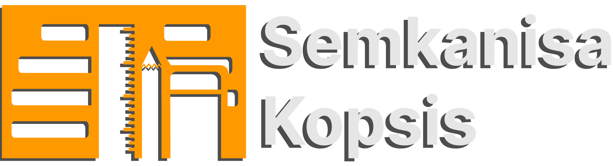

**<h2 align="center">Backend & API</h2>**
<h3 align="center"></h3>

### **About Semkanisa Kopsis Backend & API**

Nothing for now

- Framework used, [Laravel](https://laravel.com).
 Laravel is accessible, powerful, and provides tools required for large, robust applications.

### **Backend**

- Template used, [Argon](https://www.creative-tim.com/product/argon-dashboard-laravel).
  Argon is a free Dashboard template made by [Creative Tim](https://creative-tim.com/), licensed with [MIT License](https://github.com/timcreative/freebies/blob/master/LICENSE.md).

### **Made by**

- **[Aryaak](https://github.com/Aryaak)**
- **[TiarSukaCoding](https://github.com/TiarSukaCoding)**

### **License**

This is a open-sourced software licensed under the [Open Source and Free](https://opensource.org/).
